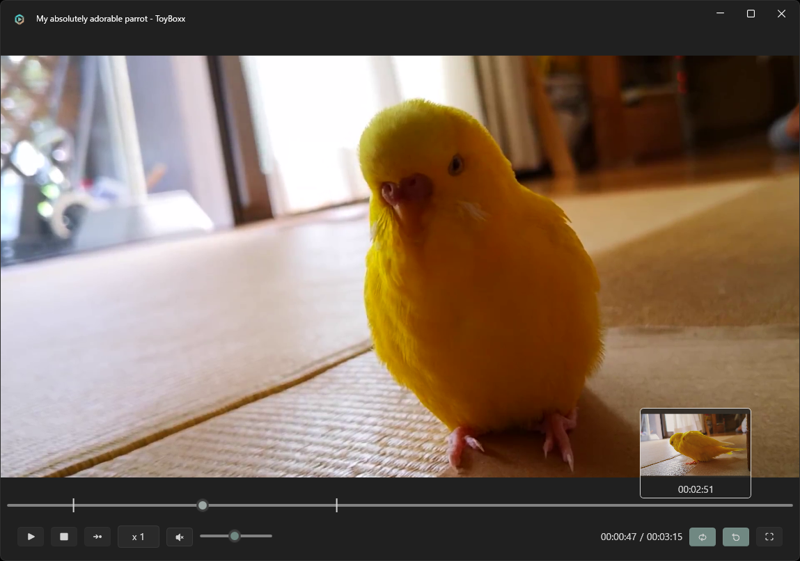

# ToyBoxx - a tiny media player
Limited, buggy, and uncustomizable, but perfect for me.



## Features

- 🌈 Themes (configure in appsettings.json)
    - Dark, Light, High Contrast
- 🖼️ Preview thumbnails when hovering over the seek bar
- 🔁 Loop playback within a selected range
- 🔍 Transform media
  - Zoom in and out (`Ctrl` + Mouse Wheel)
  - Rotate 90° clockwise (`R`)
  - Display at original size (`F`)
  - Reset view to default (`Middle click`)
- ⚡ Adjust playback speed
- ⏭️ Step forward one frame
- 📸 Capture the current frame (`S`)
- ⏱️ Jump backward or forward 5 seconds (`Left` / `Right`)

## Build
Run the following in PowerShell:

```console
$ git clone https://github.com/tackme31/ToyBoxx.git
$ cd ./ToyBoxx 
$ powershell ./requirements.ps1 # Donload FFmpeg and SoundTouch library
$ dotnet publish ./ToyBoxx/ToyBoxx.csproj -c Release -r win-x64 -p:PublishReadyToRun=true
```

Add `-p:SelfContained=true` option if needed.

## Author

- Takumi Yamada (X: [@tackme31](https://x.com/tackme31))

## License
This software is licensed under the MIT license. See [LICENSE](./LICENSE).